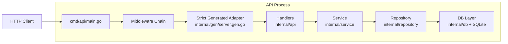

# API Architecture

This document describes the architecture of the `src` API implementation and the ownership boundaries between layers.

## Goals

- Keep business logic independent from HTTP and database details.
- Keep transport validation explicit and testable.
- Keep generated OpenAPI strict typing while preserving custom behavior from earlier versions.
- Keep the codebase easy to evolve without accidental rule duplication.

## Layered Design

Current flow:

`main -> middleware -> strict generated adapter -> handlers -> service -> repository -> db`

Dependency direction:

- `cmd/api/main.go` depends on all lower layers to wire concrete instances.
- `internal/api` depends on `internal/service` and generated types.
- `internal/service` depends only on Go stdlib and `NotesStore` interface.
- `internal/repository` depends on `gorm` and maps db models to domain models.
- `internal/db` encapsulates DB startup/migration.

Design rule:

- Outer layers can depend on inner layers.
- Inner layers must not import outer layers.

## Architecture Diagram (Mermaid)

## Request Lifecycle

For `GET /notes`, `POST /notes`, `GET /notes/{id}`, `PUT /notes/{id}`:

1. HTTP request enters generated router (`internal/gen/server.gen.go`).
2. Standard middleware chain runs (reverse wrapping in generated code).
3. Strict generated bindings decode query/path/body into typed request objects.
4. Handlers translate typed request objects to service calls.
5. Service applies domain rules and orchestrates use cases.
6. Repository performs persistence and maps errors/types.
7. Handler maps domain errors to API response objects.
8. Strict response wrapper writes typed response payload.

## Middleware Order (Important)

Generated `HandlerWithOptions(..., StdHTTPServerOptions{Middlewares: ...})` wraps middleware in reverse registration order.

So the list in `main.go` is intentionally written in reverse of runtime order.

Current registration (see `src/cmd/api/main.go`):

1. `RejectUnknownJSONFields()`
2. `EnforceQueryRules(...)`
3. `RejectUnknownQueryParams()`
4. `EnforceBodyAndContentType(...)`
5. `RequestLogger()`

Effective runtime order:

1. `RequestLogger`
2. `EnforceBodyAndContentType`
3. `RejectUnknownQueryParams`
4. `EnforceQueryRules`
5. `RejectUnknownJSONFields`
6. Generated strict bind/decode + handler

## Validation Ownership Matrix

Single owner per rule (target state and current behavior):

| Rule | Owner |
|---|---|
| Method/path routing | generated router |
| Primitive param binding (`id`, `limit` int parsing) | strict generated binder |
| Request JSON decode and required body | strict generated decoder |
| Unknown query keys | `RejectUnknownQueryParams` middleware |
| Query constraints (`after` empty/max length, `limit` range) | `EnforceQueryRules` middleware |
| Body size cap | `EnforceBodyAndContentType` middleware |
| `Content-Type: application/json` for write ops | `EnforceBodyAndContentType` middleware |
| Unknown JSON fields for `NewNote` | `RejectUnknownJSONFields` middleware |
| Cursor semantic validity (opaque token decode) | service layer |
| Sort semantic validity | service layer |
| Business constraints on note content | service layer |
| Derived fields (`title`, `wordCount`, timestamps) | service layer |
| DB not-found translation | repository layer |

Notes:

- Strict mode provides typed request/response wrappers, not full schema keyword validation.
- Some schema semantics are intentionally enforced in middleware/service to keep behavior explicit.

## Error Handling

Error contract:

- API error payload is always JSON object shape: `{"error":"..."}`

Ownership:

- Middleware rejects transport-level issues with `400/413/415`.
- Strict request/bind errors are mapped through configured request/error handlers.
- Handler maps domain sentinel errors to expected HTTP statuses.
- Unhandled errors become `500 internal server error`.

## Logging

Logging is centralized via `internal/logx` with level filtering.

Configured by:

- `LOG_LEVEL` (`debug|info|warn|error`) loaded at startup.

Current behavior:

- Request access logs emitted by `RequestLogger` with level derived from status code.
- Strict request/bind issues logged at warn.
- Strict response failures and unhandled service errors logged at error.
- Startup/shutdown informational events logged at info.

## Configuration Surface

Environment variables (from process env and optional `.env` in `src`):

- Server: `HTTP_ADDR`, `LOG_LEVEL`
- DB: `SQLITE_PATH`, `DB_MAX_OPEN_CONNS`, `DB_MAX_IDLE_CONNS`
- Service rules: `NOTE_MAX_CONTENT_LENGTH`, `NOTE_MAX_TITLE_LENGTH`, `PAGE_DEFAULT_LIMIT`, `PAGE_MAX_LIMIT`

## Generated Code Boundary

Generated files:

- `src/internal/gen/server.gen.go`
- `src/internal/gen/models.gen.go`

Rule:

- Do not edit generated files manually.
- Regenerate from `openapi.yaml` via existing generation scripts/config.

## Testing Strategy

- Service: pure unit tests with mock store.
- Repository: DB behavior tests.
- API handler: integration-ish HTTP tests through strict wrapper + middleware.
- Middleware: table-driven HTTP tests for validation behavior.
- Logging: focused unit tests for level parsing/filtering and request log fields.

## When Adding New Endpoints

1. Add endpoint/schema to `openapi.yaml`.
2. Regenerate code.
3. Add service use case and domain rules first.
4. Add repository methods needed by service interface.
5. Implement handler translation and error mapping.
6. Extend middleware allowlists/rules only for transport concerns.
7. Add tests at service + handler + middleware levels.

## Non-Goals

- This project does not implement full runtime OpenAPI schema validation middleware.
- The design favors explicit, lightweight transport checks over loading the full spec in-process.
