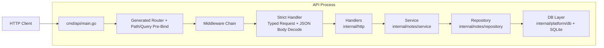

# API Architecture

This document describes the architecture of the `src` API implementation and the ownership boundaries between layers.

## Goals

- Keep business logic independent from HTTP and database details.
- Keep transport validation explicit and testable.
- Keep generated OpenAPI strict typing while preserving custom behavior from earlier versions.
- Keep the codebase easy to evolve without accidental rule duplication.

## Layered Design

Current flow:

`main -> generated router + path/query pre-bind -> middleware -> strict handler (typed request/body decode) -> handlers -> service -> repository -> db`

Dependency direction:

- `cmd/api/main.go` depends on all lower layers to wire concrete instances.
- `internal/http` depends on `internal/notes/service` and generated OpenAPI types.
- `internal/notes/service` depends only on Go stdlib and `NotesStore` interface.
- `internal/notes/repository` depends on `gorm`, maps persistence records to domain models, and implements the `NotesStore` port.
- `internal/platform/db` encapsulates DB startup/connection settings and runs migrations.
- `internal/platform/db/schema` owns the GORM persistence models used by both repository and migration.

Design rule:

- Outer layers can depend on inner layers.
- Inner layers must not import outer layers.

### Dependency Inversion In This Repo

Two directions exist and they are different:

- Runtime call flow: `handler -> service -> repository -> db`
- Compile-time imports: `http imports notes/service`, `notes/repository imports notes/service + platform/db/schema`, `platform/db imports platform/db/schema`, `notes/service imports no repository/db package`

Why `repository` imports `service`:

- `service` owns the port interface (`NotesStore`) and domain-facing types.
- `repository` is an infrastructure adapter that implements that port.
- Go interfaces are structural, so `SQLiteNotesRepository` satisfies `service.NotesStore`
  by method set; no explicit `implements` keyword is required.
- `main` composes concrete wiring (`noteRepo -> NewNotesService(noteRepo, ...)`).

Why this matters:

- Business logic remains independent from GORM/SQLite.
- Service tests can run with mocks/fakes without touching a real database.
- Storage can be swapped (SQLite/Postgres/in-memory) without changing service logic.
- Persistence schema (`NoteRecord`) is shared in `platform/db/schema`, avoiding cross-layer import inversion.

What would violate the rule:

- `service` importing `repository` or `gorm`.
- Business validation/derivations moving into repository code.

## Architecture Diagram (Mermaid)

## Request Lifecycle

For `GET /notes`, `POST /notes`, `GET /notes/{id}`, `PUT /notes/{id}`:

1. HTTP request enters generated router (`internal/http/openapi/server.gen.go`).
2. Generated pre-middleware binding parses path/query params (only on operations that have them).
3. Standard middleware chain runs (reverse wrapping in generated code).
4. Strict handler builds typed request objects; for write ops it decodes JSON body.
5. Handlers translate typed request objects to service calls.
6. Service applies domain rules and orchestrates use cases.
7. Repository performs persistence and maps errors/types.
8. Handler maps domain errors to API response objects.
9. Strict handler writes typed response payload.

Important nuance:

- Middleware executes before strict body decode and before handler logic.
- Path/query parse errors can happen before middleware because generated pre-bind runs first.
- Generated pre-bind is mainly required/type/format coercion; it does not enforce
  most schema constraints such as maxLength, numeric bounds, or enum semantics.

## Middleware Order (Important)

Generated `HandlerWithOptions(..., StdHTTPServerOptions{Middlewares: ...})` wraps middleware in reverse registration order.

So the list in `main.go` is intentionally written in reverse of runtime order.

Current registration (see `src/cmd/api/main.go`):

1. `RejectUnknownJSONFields()`
2. `EnforceQueryRules(...)`
3. `RejectUnknownQueryParams()`
4. `EnforceBodyAndContentType(...)`
5. `RequestLogger()`

Effective runtime order:

1. `RequestLogger`
2. `EnforceBodyAndContentType`
3. `RejectUnknownQueryParams`
4. `EnforceQueryRules`
5. `RejectUnknownJSONFields`
6. Strict typed request/body decode + handler

Pre-step before this list for operations with path/query params:

1. Generated path/query parsing (`id`, `limit`, etc.) runs before middleware.

## Validation Ownership Matrix

Single owner per rule (target state and current behavior):

| Rule | Owner |
|---|---|
| Method/path routing | generated router |
| Primitive param binding (`id`, `limit` int parsing) | generated pre-middleware binder |
| Request JSON decode and required body | strict handler decoder |
| Unknown query keys | `RejectUnknownQueryParams` middleware |
| Query constraints (`after` empty/max length, `limit` range) | `EnforceQueryRules` middleware |
| Body size cap | `EnforceBodyAndContentType` middleware |
| `Content-Type: application/json` for write ops | `EnforceBodyAndContentType` middleware |
| Unknown JSON fields for `NewNote` | `RejectUnknownJSONFields` middleware |
| Cursor semantic validity (opaque token decode) | service layer |
| Sort semantic validity | service layer |
| Business constraints on note content | service layer |
| Derived fields (`title`, `wordCount`, timestamps) | service layer |
| DB not-found translation | repository layer |

Notes:

- Strict mode provides typed request/response wrappers, not full schema keyword validation.
- Some schema semantics are intentionally enforced in middleware/service to keep behavior explicit.
- Practical split: generated binders reject malformed types (for example `limit=abc`);
  middleware/service enforce constraint semantics (for example `limit > max`, `after` length, allowed sort values).

## Error Handling

Error contract:

- API error payload is always JSON object shape: `{"error":"..."}`

Ownership:

- Middleware rejects transport-level issues with `400/413/415`.
- Generated pre-middleware path/query bind errors go through router `ErrorHandlerFunc`.
- Strict handler request/response errors go through strict error handlers.
- Handler maps domain sentinel errors to expected HTTP statuses.
- Unhandled errors become `500 internal server error`.

## Logging

Logging is centralized via Go `log/slog` with level filtering.

Configured by:

- `LOG_LEVEL` (`debug|info|warn|error`) loaded at startup.

Current behavior:

- Request access logs emitted by `RequestLogger` with level derived from status code.
- Strict request/bind issues logged at warn.
- Strict response failures and unhandled service errors logged at error.
- Startup/shutdown informational events logged at info.

## Configuration Surface

Environment variables (from process env and optional `.env` in `src`):

- Server: `HTTP_ADDR`, `LOG_LEVEL`
- DB: `SQLITE_PATH`, `DB_MAX_OPEN_CONNS`, `DB_MAX_IDLE_CONNS`
- Service rules: `NOTE_MAX_CONTENT_LENGTH`, `NOTE_MAX_TITLE_LENGTH`, `PAGE_DEFAULT_LIMIT`, `PAGE_MAX_LIMIT`

## Generated Code Boundary

Generated files:

- `src/internal/http/openapi/server.gen.go`
- `src/internal/http/openapi/models.gen.go`

Rule:

- Do not edit generated files manually.
- Regenerate from `openapi.yaml` via existing generation scripts/config.

## Testing Strategy

- Service: pure unit tests with in-package mock store.
- Repository: DB behavior tests.
- API handler: integration-ish HTTP tests through strict handler + middleware, with local test mock.
- Middleware: table-driven HTTP tests for validation behavior.
- Logging: focused unit tests for LOG_LEVEL parsing/configuration and request log fields/level mapping.

## When Adding New Endpoints

1. Add endpoint/schema to `openapi.yaml`.
2. Regenerate code.
3. Add service use case and domain rules first.
4. Add repository methods needed by service interface.
5. Implement handler translation and error mapping.
6. Extend middleware allowlists/rules only for transport concerns.
7. Add tests at service + handler + middleware levels.

## Non-Goals

- This project does not implement full runtime OpenAPI schema validation middleware.
- The design favors explicit, lightweight transport checks over loading the full spec in-process.
